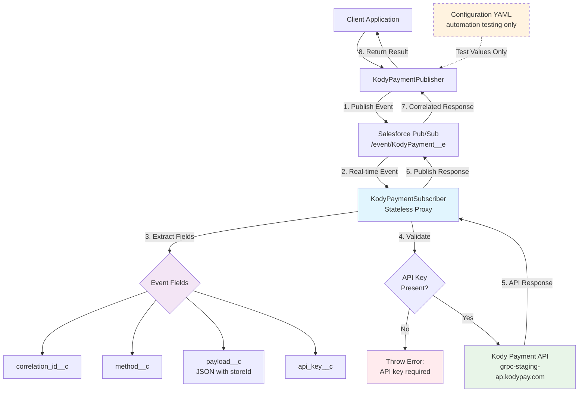

# Kody-Salesforce Integration

A Java integration between Salesforce Pub/Sub API and Kody Payment API that provides real-time payment processing through event-driven architecture.

✅ **Features:**
- Real-time payment event processing via Salesforce Pub/Sub
- Complete Kody Payment API integration (InitiatePayment, PaymentDetails, GetPayments, Refund)
- Configurable store ID and API credentials
- Comprehensive test suite with automated testing
- Request-response correlation for reliable processing

## 🚀 Quick Start

### Prerequisites
1. Java 11+ and Maven installed
2. Salesforce org with Pub/Sub API access
3. Kody Payment API credentials
4. Platform Event configured in Salesforce (see setup guide below)

### Setup
1. Clone the repository
2. Run `mvn clean install` to build the project
3. Configure your credentials in `config/arguments-sandbox.yaml`:

```yaml
# Salesforce Configuration
LOGIN_URL: https://your-org.sandbox.my.salesforce.com
USERNAME: your-username@example.com
PASSWORD: your-password-plus-security-token

# Kody Payment Configuration
KODY_HOSTNAME: grpc-staging-ap.kodypay.com
KODY_API_KEY: your-kody-api-key
KODY_STORE_ID: your-store-id
```

### Run the Integration Test
```bash
./run-test.sh sandbox
```

This will test all APIs and confirm your integration is working properly.

## 🔧 Salesforce Setup Guide

### 1. Create Platform Event in Salesforce

Navigate to **Setup** → **Platform Events** and create a new Platform Event with these specifications:

**Platform Event Definition:**
- **Label:** `KodyPayment`
- **Plural Label:** `KodyPayment` 
- **Object Name:** `KodyPayment`
- **API Name:** `KodyPayment__e`
- **Event Type:** `High Volume`
- **Publish Behavior:** `Publish After Commit`

### 2. Add Custom Fields

Add these **four custom fields** to your KodyPayment Platform Event:

| Field Label | API Name | Data Type | Length |
|-------------|----------|-----------|---------|
| `correlation_id` | `correlation_id__c` | Text | 255 |
| `method` | `method__c` | Text | 255 |
| `payload` | `payload__c` | Long Text Area | 131072 |
| `api_key` | `api_key__c` | Text | 255 |

**Step-by-step field creation:**
1. Click **New** in the Custom Fields & Relationships section
2. Select the appropriate data type
3. Enter the field label and API name exactly as shown above
4. Set the length as specified
5. Complete the field setup with default security settings

### 3. Deploy the Platform Event

1. Click **Deploy** on the Platform Event detail page
2. Verify the deployment status shows **"Deployed"**
3. Note the topic name will be `/event/KodyPayment__e`

### 4. Configure User Permissions

Ensure your integration user has:
- **"View All Data"** permission (for Pub/Sub API access)
- **"Modify All Data"** permission (for publishing events)
- **"API Enabled"** permission
- Access to the **KodyPayment** Platform Event

### 5. Get Integration Details

Collect these details for your configuration:

```yaml
# From your Salesforce org
LOGIN_URL: https://your-org.sandbox.my.salesforce.com  # Your org URL
USERNAME: your-integration-user@example.com            # Integration user
PASSWORD: password+security_token                      # Password + Security Token
USER_ID: 018XXXXXXXXXXXXXXX                           # User ID (15 or 18 chars)

# Platform Event topic (automatically generated)
TOPIC: /event/KodyPayment__e
```

### 6. Test Platform Event

You can test the Platform Event in Salesforce using Anonymous Apex:

```apex
// Test publishing a KodyPayment event
KodyPayment__e testEvent = new KodyPayment__e(
    correlation_id__c = 'test-123',
    method__c = 'request.ecom.v1.InitiatePayment',
    payload__c = '{"storeId": "your-store-id", "test": "data"}',
    api_key__c = 'your-kody-api-key'
);

EventBus.publish(testEvent);
System.debug('Test event published');
```

### 7. Verify Setup

Your Platform Event setup is complete when:
- ✅ Platform Event shows **"Deployed"** status
- ✅ All four custom fields are created and active
- ✅ Integration user has proper permissions
- ✅ Topic `/event/KodyPayment__e` is accessible
- ✅ Test event publishing works in Anonymous Apex

## 🧪 Testing

### Comprehensive Test
Tests all APIs automatically:
```bash
./run-test.sh sandbox
```

### Individual API Tests
Test specific APIs:
```bash
# Test InitiatePayment
mvn exec:java -Dexec.mainClass="genericpubsub.KodyPaymentQuickTest" -Dexec.classpathScope="test" -Dexec.args="sandbox request.ecom.v1.InitiatePayment"

# Test PaymentDetails (requires payment ID)
mvn exec:java -Dexec.mainClass="genericpubsub.KodyPaymentQuickTest" -Dexec.classpathScope="test" -Dexec.args="sandbox request.ecom.v1.PaymentDetails your-payment-id"

# Test GetPayments
mvn exec:java -Dexec.mainClass="genericpubsub.KodyPaymentQuickTest" -Dexec.classpathScope="test" -Dexec.args="sandbox request.ecom.v1.GetPayments"

# Test Refund (requires payment ID)
mvn exec:java -Dexec.mainClass="genericpubsub.KodyPaymentQuickTest" -Dexec.classpathScope="test" -Dexec.args="sandbox request.ecom.v1.Refund your-payment-id"
```

### Manual Testing
For manual integration testing:

**Terminal 1 - Start Subscriber:**
```bash
./run.sh genericpubsub.KodyPaymentSubscriber sandbox
```

**Terminal 2 - Send Payment Requests:**
```bash
# InitiatePayment
./run.sh genericpubsub.KodyPaymentPublisher sandbox request.ecom.v1.InitiatePayment '{
  "storeId": "your-store-id",
  "paymentReference": "pay_123456",
  "amountMinorUnits": 1000,
  "currency": "GBP",
  "orderId": "order_123456",
  "returnUrl": "https://example.com/return",
  "payerEmailAddress": "test@example.com"
}' 'your-custom-api-key'

# GetPayments
./run.sh genericpubsub.KodyPaymentPublisher sandbox request.ecom.v1.GetPayments '{
  "storeId": "your-store-id",
  "pageCursor": {"page": 1, "pageSize": 10}
}' 'your-custom-api-key'
```

## 📋 Supported Kody APIs

1. **InitiatePayment** - Creates new payment requests
2. **PaymentDetails** - Retrieves payment information by ID
3. **GetPayments** - Lists payments with pagination
4. **Refund** - Processes payment refunds

## 🏗️ Architecture

### Core Components

- **KodyPaymentPublisher** - Generic command-line publisher that accepts any method and JSON payload
- **KodyPaymentSubscriber** - Real-time event subscriber that acts as a stateless proxy to Kody API
- **ApplicationConfig** - Configuration management for external settings
- **Test Suite** - Comprehensive testing utilities

### Proxy Architecture

The subscriber implements a **pure proxy pattern** where:
- All API keys must be provided in the `api_key__c` field of each Platform Event
- All store IDs must be included in the JSON payload
- No automatic injection or fallback to configuration values occurs at runtime
- Configuration values are used only for automation testing

### Event Flow



**Flow Details:**
1. **Publisher** sends payment request to Salesforce Pub/Sub topic with all required fields
2. **Subscriber** receives event in real-time via streaming subscription
3. **Field Extraction** from Platform Event: correlation_id__c, method__c, payload__c, api_key__c
4. **Validation** ensures API key is present (pure proxy - no fallback to config)
5. **Kody API Call** using extracted API key and JSON payload with storeId
6. **Response Publishing** back to same Salesforce topic with correlation ID
7. **Correlated Response** received by publisher waiting for specific correlation ID
8. **Result Return** to client application

## ⚙️ Configuration

All configuration is externalized in `arguments-sandbox.yaml`:

```yaml
# Salesforce Pub/Sub Settings
PUBSUB_HOST: api.pubsub.salesforce.com
PUBSUB_PORT: 7443
TOPIC: /event/KodyPayment__e

# Authentication (use either username/password OR accessToken/tenantId)
USERNAME: your-username
PASSWORD: your-password-plus-security-token
# OR
ACCESS_TOKEN: your-session-token
TENANT_ID: your-tenant-id

# Kody Payment Integration
KODY_HOSTNAME: grpc-staging-ap.kodypay.com  # Use -ap for Asia, -eu for Europe
KODY_API_KEY: your-api-key
KODY_STORE_ID: your-store-id  # Used for automation testing only
```

## 🔧 Project Structure

```
src/
├── main/java/
│   ├── genericpubsub/
│   │   ├── KodyPaymentPublisher.java    # Generic command-line publisher
│   │   ├── KodyPaymentSubscriber.java   # Real-time event subscriber
│   │   ├── GetSchema.java               # Utility for schema operations
│   │   └── GetTopic.java                # Utility for topic operations
│   └── utility/
│       ├── ApplicationConfig.java       # Configuration management
│       └── CommonContext.java           # Shared Salesforce context
└── test/java/genericpubsub/
    ├── KodyPaymentManualTest.java       # Comprehensive integration test
    ├── KodyPaymentQuickTest.java        # Individual API testing
    └── KodyPaymentIntegrationTest.java  # JUnit integration test
```

## 🐛 Expected Behavior

When testing with demo credentials, you may see API errors like:
- `PERMISSION_DENIED: Invalid API Key`
- `INVALID_ARGUMENT: ValidationError`

These errors are **expected** and confirm the integration is working - you're successfully reaching the Kody API with test data.

## 🔧 Troubleshooting

### Common Issues

**Q: Getting `NoClassDefFoundError: io.grpc.internal.NoopClientStream`**
- **Solution**: This has been fixed in the latest version. Run `mvn clean install` to rebuild with updated dependencies.

**Q: Getting `ClassNotFoundException: ch.qos.logback.classic.spi.ThrowableProxy`**
- **Solution**: This has been resolved by upgrading logback to 1.4.14. Rebuild the project to apply the fix.

**Q: Subscriber crashes with dependency errors**
- **Solution**: The project now includes all required gRPC dependencies. Clean rebuild should resolve any lingering issues:
  ```bash
  mvn clean install
  ./run.sh genericpubsub.KodyPaymentSubscriber sandbox
  ```

**Q: Multiple versions of the same library causing conflicts**
- **Solution**: Dependencies have been cleaned up and unified. All protobuf libraries now use the same version (4.31.0).

## 📝 Usage Examples

### Passing API Keys
The publisher supports two modes for API key handling:

**Option 1: Using API Key from Configuration (Default):**
```bash
# Uses KODY_API_KEY from config/arguments-sandbox.yaml
./run.sh genericpubsub.KodyPaymentPublisher sandbox request.ecom.v1.InitiatePayment '{
  "storeId": "your-store-id",
  "paymentReference": "pay_123456",
  "amountMinorUnits": 1000,
  "currency": "GBP",
  "orderId": "order_123456",
  "returnUrl": "https://example.com/return",
  "payerEmailAddress": "test@example.com"
}'
```

**Option 2: Using Custom API Key (Override):**
```bash
# Pass your own API key as 4th parameter
./run.sh genericpubsub.KodyPaymentPublisher sandbox request.ecom.v1.InitiatePayment '{
  "storeId": "your-store-id",
  "paymentReference": "pay_123456",
  "amountMinorUnits": 1000,
  "currency": "GBP",
  "orderId": "order_123456",
  "returnUrl": "https://example.com/return",
  "payerEmailAddress": "test@example.com"
}' 'your-custom-api-key'
```

**How It Works:**
- The API key is sent in the `api_key__c` field of the Platform Event
- The subscriber extracts this API key and uses it for the Kody API call
- This enables true proxy mode where each request can use different API keys

### JSON Payload Requirements
**Important:** The `storeId` field is required in all payment request payloads.

## 🚀 Recent Improvements

### ✅ Latest Updates (August 2025)
- **🔧 Dependency Fixes** - Resolved gRPC `NoClassDefFoundError` and logback `ThrowableProxy` issues for stable runtime
- **📦 Updated Dependencies** - Upgraded to logback 1.4.14 and added missing grpc-core dependency
- **🧹 Cleaned Dependencies** - Removed redundant dependencies and unified protobuf versions for consistency
- **✅ Runtime Stability** - Eliminated all ClassNotFoundException and dependency conflicts
- **🔧 Thread-Safe Concurrent Requests** - Fixed race conditions in KodyPaymentPublisher to support multiple simultaneous requests
- **📝 Clear Method Names** - All APIs now use full method names (e.g., `request.ecom.v1.InitiatePayment`) for better clarity
- **📁 Simplified Configuration** - Unified configuration management using only `config/` directory
- **🐳 Docker Integration Verified** - Complete end-to-end testing with containerized deployment
- **📚 Updated Documentation** - All examples and test cases reflect the new method naming

### 🎯 Production-Ready Features
- **🚀 Zero Runtime Errors** - All dependency conflicts resolved, no more ClassNotFoundException or missing dependencies
- **Concurrent Processing** - Multiple payment requests can be processed simultaneously without interference
- **Robust Error Handling** - Comprehensive error handling with proper correlation tracking
- **Real-Time Processing** - Sub-second response times for payment operations
- **Container Support** - Full Docker support with proper volume mounting and networking

## 🐳 Docker Deployment

### Quick Start with Docker
```bash
# 1. Build the Docker image
./docker-build.sh

# 2. Configure your credentials (config files are already in config/ directory)
# Edit config/arguments-sandbox.yaml with your credentials

# 3. Start the service
./docker-run.sh
```

### Docker Commands
```bash
# View live logs
docker-compose logs -f

# Check service status
docker-compose ps

# Stop the service
docker-compose down

# Restart the service
docker-compose restart
```

### Production Deployment
For production deployment on any Docker-compatible platform:

1. **Build and push to registry:**
```bash
docker build -t your-registry/kody-salesforce-integration:v1.0 .
docker push your-registry/kody-salesforce-integration:v1.0
```

2. **Deploy with your orchestrator:**
- **Docker Swarm:** `docker stack deploy -c docker-compose.yml kody-stack`
- **Kubernetes:** Convert using Kompose or create K8s manifests
- **AWS ECS/Fargate:** Use the Docker image with ECS task definitions
- **Google Cloud Run:** Deploy directly from container registry

3. **Environment Variables:**
- `JAVA_OPTS`: JVM tuning options
- `KODY_ENV`: Environment name (sandbox/production)

### Container Features
- ✅ **Multi-stage build** for smaller production images
- ✅ **Non-root user** for security
- ✅ **Health checks** built-in
- ✅ **Log rotation** configured
- ✅ **Graceful shutdown** with proper signal handling
- ✅ **Resource limits** and memory optimization

## 🤝 Contributing

1. All test files are properly organized in `src/test/java/`
2. Configuration is externalized in YAML files
3. Follow Maven conventions for project structure
4. Run tests before submitting changes: `./run-test.sh sandbox`